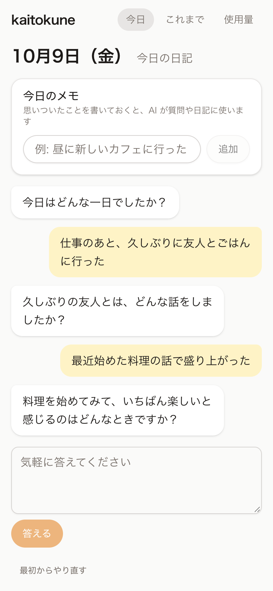
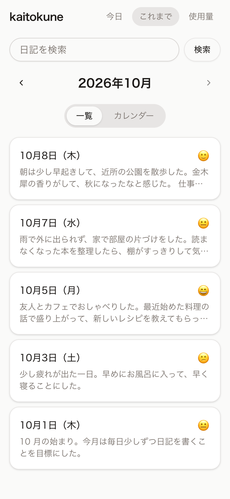
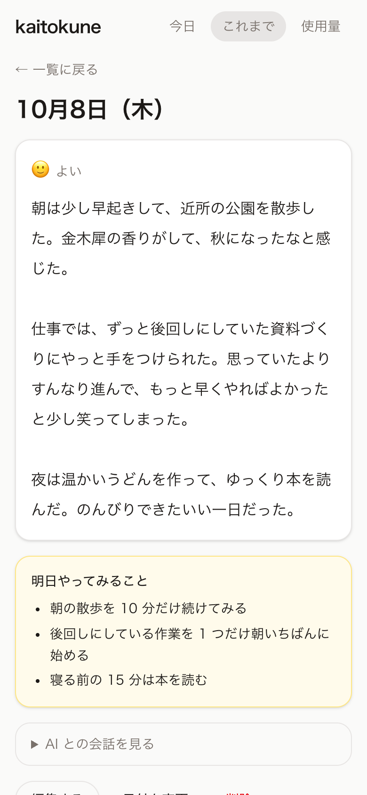

# kaitokune

[](https://github.com/ohiaeni/kaitokune/actions/workflows/ci.yml)
[](https://github.com/ohiaeni/kaitokune/releases/latest)
[](LICENSE)

AI からの質問に答えるだけで、毎日の日記がかんたんに書けるアプリ。

> **絶対条件: 完全無料で運用できること**
> ホスティング・DB・AI のすべてを、クレジットカード登録不要／従量課金なしの無料枠で構成する。

<p align="center">
  
  
  
</p>

<sub>※ 画面はダミーデータで撮影したもの。</sub>

## 使い方の流れ

1. アプリを開くと、AI が今日について 1 問ずつ質問してくる（直近の日記を踏まえて話題をつなげることもある）
2. 短く答えると、AI がその回答を深掘りしたり別の話題に広げたりして、次の質問をする（3〜5 往復）
3. 「日記にまとめる」を押すと、回答をもとに AI が日記の文章を書き、明日すぐ試せる小さな行動（「明日やってみること」）を 1〜3 個提案する（同じ 1 回の AI 呼び出しで作る）
4. 文章を自由に直し、気分（5 段階）を選んで保存する。提案も日記と一緒に保存され、あとから日記の画面で見返せる
5. 「これまで」から月ごとに過去の日記を読み返したり、編集・削除したりできる（一覧とカレンダーを切り替えられる）

書きかけの会話はブラウザに保存されるので、途中で閉じても続きから再開できる。

## 構成

少人数（今は 2 人）で使う前提で、アプリにはログイン画面を持たせない。Cloudflare Access（無料）で許可したメールアドレスの人だけを通し、Worker は Access が付ける JWT を検証してユーザーを決める。日記などのデータはすべてユーザーごとに分かれていて、ほかの人のデータは読み書きできない。

```text
┌──────────────────────────────┐
│  ブラウザ / スマホ             │
│  React + Vite + Tailwind CSS │
└──────────────┬───────────────┘
               │ HTTPS（Cloudflare Access で許可した人のみ）
┌──────────────▼───────────────────────────────┐
│  Cloudflare Workers (Hono)                    │
│   ※ Access の JWT を検証し、users に登録した人だけ通す │
│   ├─ /api/chat/next     … 次の質問を生成        │
│   ├─ /api/chat/compose  … 回答 → 日記本文と提案を生成 │
│   ├─ /api/entries       … 日記の CRUD          │
│   ├─ /api/export        … 日記のエクスポート     │
│   ├─ /api/notes         … その日のメモ          │
│   └─ /api/usage         … 無料枠の消費状況     │
│   ※ それ以外のパスは静的アセット（SPA）を返す     │
└───────┬─────────────────────────┬────────────┘
        │                         │
┌───────▼────────┐      ┌─────────▼──────────────────┐
│ Cloudflare D1  │      │ AI                          │
│ (SQLite)       │      │  メイン: Workers AI          │
│ Drizzle ORM    │      │  予備  : Gemini API 無料枠    │
└────────────────┘      └────────────────────────────┘
```

| レイヤー                  | 採用技術                                                                        | 無料である理由 / 選定理由                                                                       |
| ------------------------- | ------------------------------------------------------------------------------- | ----------------------------------------------------------------------------------------------- |
| フロントエンド            | React 19 + Vite + TypeScript                                                    | OSS。`@cloudflare/vite-plugin` で Worker と 1 つのプロジェクトとして開発・デプロイできる        |
| UI                        | Tailwind CSS v4 + shadcn/ui（Radix UI）                                         | OSS。スマホファーストのチャット風 UI。部品は `src/client/components/ui/` に CLI で追加する      |
| ルーティング / データ取得 | TanStack Router（ファイルベース）+ TanStack Query                               | 型安全なルーティングとキャッシュ                                                                |
| API                       | Hono on Cloudflare Workers                                                      | Workers の無料枠（1 日 10 万リクエスト程度）で個人利用には十分                                  |
| 静的ホスティング          | Workers Static Assets                                                           | 無料・帯域無制限                                                                                |
| DB                        | Cloudflare D1 + Drizzle ORM                                                     | D1 の無料枠（数 GB）。テキストの日記なら事実上使い切れない                                      |
| 認証                      | Cloudflare Access（Zero Trust 無料プラン）                                      | 50 ユーザーまで無料。ログイン画面を作らずに利用者を制限でき、Worker は JWT を検証するだけで済む |
| AI（メイン）              | Cloudflare Workers AI                                                           | 1 日あたりの無料枠（Neurons）。API キー不要                                                     |
| AI（予備）                | Google Gemini API 無料ティア                                                    | 日本語の品質が高い。Workers AI が失敗したときのフォールバック先                                 |
| 品質                      | Biome / Prettier（Markdown・YAML）/ Vitest（`@cloudflare/vitest-pool-workers`） | Workers ランタイム上でローカル D1 を使ってテストする                                            |

### 「完全無料」を守るためのガード

- **カードを登録しない**: Cloudflare・Google AI Studio ともにカード未登録のまま無料枠だけを使う。カード未登録なら超過しても課金されず、エラーになるだけ。
- **アプリ側の利用上限**: AI の呼び出し回数を D1 でユーザーごと・日ごとに数え、`AI_DAILY_LIMIT`（1 人あたり。初期値 25 回）を超えたら 429 を返して止める。全体ではユーザー数 × `AI_DAILY_LIMIT` 回まで（2 人なら 50 回）。日記 1 日分で使うのは最大 6 回程度。
- **フォールバック**: Workers AI がエラー（レート制限・障害・不正な出力など）になったら、Gemini に切り替える。
- **会話の上限**: 質問は最大 5 問。5 問に達したら AI を呼ばずに会話を終える。

## ディレクトリ構成

```text
kaitokune/
├── src/
│   ├── worker/               # Cloudflare Worker（Hono）
│   │   ├── app.ts            # アプリ本体（ミドルウェアとルートをつなぐ）
│   │   ├── middleware/       # 認証（auth.ts）、Cloudflare Access の JWT の検証（cloudflare-access.ts）、DB などの注入（context.ts）、1 日の AI 呼び出し上限（ai-quota.ts）
│   │   ├── lib/              # 共通の処理
│   │   │   ├── errors.ts     #   エラーを API のエラー（ステータスと本文）に変換
│   │   │   ├── validation.ts #   入力の検証に失敗したときのレスポンス
│   │   │   └── cloudflare-usage.ts # GraphQL Analytics API から無料枠の消費状況を取得
│   │   ├── routes/           # 入力の検証とレスポンスだけ
│   │   │   ├── chat.ts       #   質問・日記と提案の生成
│   │   │   ├── entries.ts    #   日記の CRUD・検索・日付の変更
│   │   │   ├── export.ts     #   日記のエクスポート
│   │   │   ├── notes.ts      #   その日のメモ
│   │   │   └── usage.ts      #   無料枠の消費状況
│   │   ├── ai/               # プロバイダ（workers-ai / gemini）、フォールバック、プロンプト
│   │   ├── db/               # データアクセス（クエリはここにだけ書き、必ずユーザーで絞り込む）
│   │   │   ├── schema.ts     #   Drizzle のスキーマ
│   │   │   ├── users.ts      #   利用者
│   │   │   ├── entries.ts    #   日記と会話の記録
│   │   │   ├── search.ts     #   キーワード検索
│   │   │   ├── notes.ts      #   その日のメモ
│   │   │   └── ai-usage.ts   #   AI 呼び出し回数
│   │   └── export/           # エクスポートの Markdown の生成
│   ├── shared/               # クライアントと Worker で共有する Zod スキーマ・定数・型・日付の表示
│   └── client/               # React SPA
│       ├── routes/           # / （今日の日記）, /entries（一覧）, /entries/$date（詳細）, /usage（使用量）
│       ├── components/       # Interview（会話）, DiaryEditor, EntryView, NotesPanel など。画面ごとの部品は interview/ entries/ entry/ usage/、shadcn/ui の部品は ui/
│       ├── hooks/            # 画面の状態と操作（useInterview など）、TanStack Query のフック（queries.ts）
│       └── lib/              # フックではない共通の処理（API クライアント、日付、localStorage、下書き、検索語の強調）
├── test/                     # Vitest（Workers ランタイム上で実行）。src/ と同じ分け方（worker/ai・db・export・middleware・routes、shared、client/lib）
├── docs/                     # セットアップ手順（setup.md）・画面のスクリーンショット
├── migrations/               # drizzle-kit が生成する D1 マイグレーション
└── wrangler.jsonc            # バインディング（D1 / AI）と設定値
```

### データモデル

| テーブル   | 主なカラム                                                                                                                               | 説明                                                                                                   |
| ---------- | ---------------------------------------------------------------------------------------------------------------------------------------- | ------------------------------------------------------------------------------------------------------ |
| `users`    | `id`（PK）, `email`（一意）, `created_at`                                                                                                | アプリを使える人。ここに登録したメールアドレスだけが API を使える                                      |
| `entries`  | `user_id`（→ users）, `date`（YYYY-MM-DD）, `body`, `mood`（1〜5, 任意）, `suggestions`（JSON の文字列配列）, `created_at`, `updated_at` | 1 人 1 日 1 件の日記（PK は `user_id` + `date`）。`suggestions` は AI が提案した「明日やってみること」 |
| `qa_logs`  | `user_id`, `entry_date`（→ entries）, `position`, `question`, `answer`                                                                   | 日記のもとになった AI との会話                                                                         |
| `notes`    | `user_id`（→ users）, `date`, `body`, `created_at`                                                                                       | 日記を書く前にメモしておいた、その日の出来事や思ったこと（日記の生成で AI に渡す）                     |
| `ai_usage` | `user_id`（→ users）, `date`, `count`                                                                                                    | AI 呼び出し回数（利用上限用。PK は `user_id` + `date`）                                                |

`users` 以外のテーブルはすべて `user_id` を持ち、API は必ずログインしているユーザーの `user_id` で絞り込む。ユーザーを削除すると、そのユーザーのデータもすべて消える（ON DELETE CASCADE）。

## セットアップ

Cloudflare アカウントの作成からデプロイ、アクセス制限までの詳しい手順は **[docs/setup.md](docs/setup.md)** にまとめています。以下はローカルで動かすまでの要約です。

必要なもの: Node.js 24 以上（npm 11 以上。バージョンは `.node-version` に記載）、Cloudflare アカウント（無料）、任意で Google AI Studio の API キー（無料）。

```sh
npm install
cp .dev.vars.example .dev.vars    # DEV_USER_EMAIL はそのままでよい。Gemini を使う場合は GEMINI_API_KEY を記入
npm run db:migrate:local          # ローカル D1 にテーブルを作成
npm run dev                       # http://localhost:5173（AI はモック）
```

- `npm run dev` は Cloudflare に接続せず、AI だけをモックする（`src/worker/ai/mock.ts`）。Worker と D1 は本物のまま動き、AI は毎回同じ質問と、回答をつなげただけの日記を返すので、ログインや API キーが要らず、AI の無料枠も使わない。モックの呼び出しも `AI_DAILY_LIMIT` に数えるので、利用上限の画面も確かめられる（上限を変えたいときは `.dev.vars` に `AI_DAILY_LIMIT` を書く）。
- 本物の AI を試すときは `npx wrangler login` してから `npm run dev:remote` を使う。Workers AI は開発中もリモート（自分のアカウントの無料枠）で動く。
- ログインせずに本物の AI を試すときは `npm run dev:local` を使う。この場合 Workers AI は使えず、`.dev.vars` に設定した Gemini だけで動く。
- 画面だけを直すときは `npm run dev:mock` を使う。Worker を起動せず、[MSW](https://mswjs.io/) が `/api/*` をモックする（`src/client/mocks/`）ので、ログインや API キーが要らず、AI の無料枠も使わない。データはメモリ上にだけあり、ページを読み込み直すと元に戻る。画面左下のセレクトボックスで、日記が 0 件・大量、AI のエラー、利用上限への到達などの状態に切り替えられる。エクスポートはモックしない。
- ローカルでは Access を通らないので、`.dev.vars` の `DEV_USER_EMAIL` のユーザーとして動く。初期値の `owner@example.invalid` はマイグレーションで作られるユーザー（id=1）。
- `npm install` で Git フック（[lefthook](https://lefthook.dev/)）が入り、コミット前に変更したファイルへ Biome の lint・フォーマットと、Prettier（Markdown・YAML）の整形がかかる。設定は `lefthook.yml`。

### 主なコマンド

| コマンド                              | 内容                                                                                 |
| ------------------------------------- | ------------------------------------------------------------------------------------ |
| `npm run dev`                         | 開発サーバー（Cloudflare に接続せず、AI はモック）                                   |
| `npm run dev:remote` / `dev:local`    | 本物の AI を使う開発サーバー（前者は Workers AI、後者は Gemini だけ）                |
| `npm run dev:mock`                    | Worker を起動せず、API をモックして画面だけを動かす開発サーバー                      |
| `npm test`                            | テスト（AI はモックするので無料枠を消費しない）                                      |
| `npm run typecheck` / `npm run check` | 型チェック / Biome による lint・フォーマットと、Prettier（Markdown・YAML）のチェック |
| `npm run spell`                       | cspell によるスペルチェック（辞書は `cspell.config.yaml`）                           |
| `npm run db:generate`                 | `src/worker/db/schema.ts` の変更からマイグレーションを生成                           |
| `npm run cf-typegen`                  | `wrangler.jsonc` を変えたら実行し、`worker-configuration.d.ts` を更新                |

### 設定値（`wrangler.jsonc` の `vars`）

| 名前               | 初期値                          | 説明                                                                  |
| ------------------ | ------------------------------- | --------------------------------------------------------------------- |
| `WORKERS_AI_MODEL` | `@cf/google/gemma-4-26b-a4b-it` | Workers AI のモデル。`npx wrangler ai models list` で一覧を確認できる |
| `GEMINI_MODEL`     | `gemini-flash-latest`           | 予備の Gemini モデル                                                  |
| `AI_DAILY_LIMIT`   | `25`                            | 1 人 1 日あたりの AI 呼び出し上限（ユーザーごとに数える）             |
| `TIMEZONE`         | `Asia/Tokyo`                    | 利用上限を数える「1 日」の区切り                                      |

シークレットの `GEMINI_API_KEY` は、ローカルでは `.dev.vars`、本番では `npx wrangler secret put GEMINI_API_KEY` で設定する。使用量の画面に Cloudflare の無料枠の消費状況を出す場合は、`CF_ANALYTICS_TOKEN`（Account Analytics: Read の API トークン）と `CF_ACCOUNT_ID` も同じ方法で設定する（[docs/setup.md の手順 10](docs/setup.md#アプリで確認する)）。

本番では、Access の JWT を検証するための `ACCESS_TEAM_DOMAIN`（チームドメイン）と `ACCESS_AUD`（Access アプリケーションの AUD タグ）も `npx wrangler secret put` で設定する（必須。[docs/setup.md の手順 9-5](docs/setup.md#9-5-worker-に-access-の設定を登録する)）。設定がなければ API はすべて 401 を返す。

## デプロイ

```sh
npx wrangler d1 create kaitokune      # 表示された database_id を wrangler.jsonc に書き込む
npm run db:migrate:remote
npx wrangler secret put GEMINI_API_KEY  # 任意
npm run deploy                          # https://kaitokune.<サブドメイン>.workers.dev
```

**デプロイしたら必ず Cloudflare Access で使える人を制限し、Worker に Access の設定とユーザーを登録する。** 設定するまで API は 401 / 403 を返すので日記は読めないが、使うこともできない。設定手順は [docs/setup.md の手順 9](docs/setup.md#9-cloudflare-access-で使える人を制限する) を参照。

## 開発ロードマップ

- [x] **MVP**: 会話型の質問 → 日記の生成 → 編集・保存、一覧・詳細、利用上限、フォールバック
- [x] 過去の日記の日付の変更（#12）
- [x] その日のメモを残して日記の生成に使う（#15）
- [x] 振り返り: キーワード検索（#42）、カレンダー表示（#44）
- [x] 日記のエクスポート（#43）
- [x] 無料枠の消費状況を表示する使用量画面（#45）
- [x] 複数ユーザー対応（Cloudflare Access の JWT 検証、ユーザーごとのデータの分離）（#52）
- [x] 日記と一緒に「明日やってみること」を提案する（#90）
- [ ] 振り返り: 気分の推移グラフ
- [ ] PWA 化、毎晩のリマインド通知（Cron Trigger + Web Push。どちらも無料）
- [ ] 音声入力（Web Speech API）、週・月ごとの振り返りを AI がまとめる機能

<details>
<summary>技術選定時に比較した AI サービス・代替構成</summary>

| サービス                                         | 無料の形態                   | 日本語品質 | 長所                                     | 注意点                                                             |
| ------------------------------------------------ | ---------------------------- | ---------- | ---------------------------------------- | ------------------------------------------------------------------ |
| **Cloudflare Workers AI**                        | 1 日ごとの無料枠             | ○          | インフラと統合、キー不要、カード登録不要 | 無料枠超過分は課金対象になるため、上限チェックを実装する           |
| **Google Gemini API**                            | 無料ティア（レート制限あり） | ◎          | 日本語が自然、高性能                     | 無料ティアでは入力データが Google の品質改善に使われる可能性がある |
| **Groq**                                         | 無料ティア（レート制限あり） | ○          | 非常に高速                               | モデルの入れ替わりが早い                                           |
| **OpenRouter（`:free` モデル）**                 | 無料モデル枠                 | △〜○       | 多数のモデルを 1 つの API で試せる       | 1 日のリクエスト数制限が厳しめ                                     |
| **ブラウザ内 AI（WebLLM / Chrome Built-in AI）** | 完全ローカル                 | △          | サーバー不要、データが端末外に出ない     | 端末性能に依存、初回のモデルダウンロードが重い                     |

- **ローカルファースト構成**（IndexedDB + ブラウザ内 AI）: 日記が端末の外に出ないが、端末間で同期できず、日本語の文章品質も下がる。
- **Next.js + Supabase 構成**: 情報は多いが、Vercel Hobby は非商用に限られ、Supabase の無料プロジェクトはしばらく使わないと一時停止される。

</details>

## 変更履歴

バージョンごとの変更点は [Releases](https://github.com/ohiaeni/kaitokune/releases) を参照。リリースノートは、直前の本番版からマージされた PR をラベルごとにまとめて自動生成している。

## コントリビュート・セキュリティ

- 開発の進め方（issue・PR の運用、よく使うコマンド）は [CONTRIBUTING.md](CONTRIBUTING.md) を参照。
- 脆弱性を見つけた場合は、公開の issue ではなく [SECURITY.md](SECURITY.md) の方法で報告してほしい。

## ライセンス

[MIT](LICENSE)

## 注意事項

- 各サービスの無料枠の内容（回数・容量・対象モデル）は頻繁に変わるため、公式の料金ページで確認すること。
- 日記はプライベートな情報。Gemini の無料ティアでは、送った内容が Google の品質改善に使われる可能性がある。気になる場合は `GEMINI_API_KEY` を設定せず、Workers AI だけで使う。
